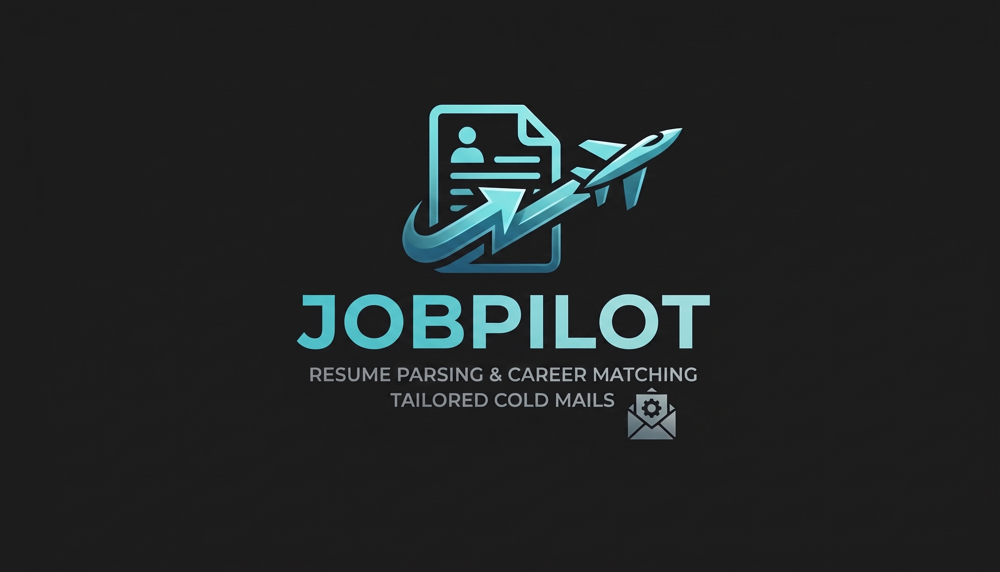

FitNode
---
<div align="center">
  

Your AI copilot for the job hunt.

Upload your resume once, discover relevant roles, generate tailored resumes, and draft recruiter outreach from one focused workspace.

Live App

</div>

##Overview

FitNode helps job seekers spend less time repeating application work and more time preparing for interviews. It combines resume-based job matching with customizable search preferences and AI-assisted application materials.

After uploading a resume, users can review ranked job matches, inspect match scores, tailor their resume for a specific role, and generate a cold email for recruiter outreach. A separate Tailor Chat also lets users paste any job description and create targeted application content on demand.

## Features

* 📄 **Resume Upload** — Upload PDF/DOCX resumes up to 5 MB.
* 🎯 **Personalized Job Search** — Discover roles based on your resume and preferences.
* 🔎 **Multiple Job Sources** — Search listings from Adzuna and USAJobs.
* 📊 **Match Scoring** — Rank jobs by relevance to your experience.
* ⚙️ **Smart Filters** — Filter by role, location, work mode, keywords, and match score.
* ✨ **AI Resume Tailoring** — Generate role-specific resume drafts.
* 📧 **Recruiter Outreach** — Create personalized cold emails for opportunities.
* 💬 **Tailor Chat** — Paste any job description to generate a tailored resume and email.
* 📈 **Dashboard** — Track matches, scores, and generated drafts.
* 🔐 **Authentication** — Secure sign-up, sign-in, password recovery, and sessions.

## How It Works

**Upload Resume → Set Preferences → Find & Score Jobs → Review Matches → Tailor Resume → Contact Recruiters**

1. Create an account and set your job preferences.
2. Upload your resume.
3. FitNode finds and scores relevant jobs.
4. Review matches and visit original listings.
5. Generate tailored resumes and recruiter emails.
6. Use **Tailor Chat** for jobs found outside FitNode.

## Tech Stack

* **Frontend:** Next.js, React, Tailwind CSS
* **Backend & Auth:** Supabase
* **Job Sources:** Adzuna, USAJobs
* **AI:** Server-side AI generation
* **Deployment:** Vercel

## Main Areas

| Area        | Purpose                                   |
| ----------- | ----------------------------------------- |
| Dashboard   | Resume and job-search overview            |
| Job Matches | Ranked jobs, scores, and generated drafts |
| Tailor Chat | Resume and email generation               |
| Settings    | Search preferences and filters            |
| Onboarding  | Initial job-search setup                  |

## Getting Started

### Prerequisites

* Node.js 20+
* npm
* Supabase project
* Job-data and AI service credentials

### Installation

```bash
git clone <repository-url>
cd fitnode
npm install
cp .env.example .env.local
```

Add the required environment variables, then run:

```bash
npm run dev
```

Open **http://localhost:3000**

### Available Scripts

```bash
npm run dev      # Development server
npm run build    # Production build
npm run start    # Start production build
npm run lint     # Run lint checks
```

## Project Structure

```text
fitnode/
├── app/          # Pages and API routes
├── components/   # Reusable UI components
├── lib/          # Supabase and shared utilities
├── public/       # Static assets
└── README.md
```

## Privacy & Security

* Resume files are restricted to their owners.
* Validate file types and sizes on client and server.
* Keep API keys and service-role credentials server-side.
* Use Row Level Security for user data.
* Avoid logging resumes, application materials, or authentication tokens.

## Future Improvements

* Saved jobs and application tracking
* Resume version history
* Cover-letter generation
* Recruiter/company research
* Interview preparation
* More job-board integrations

## Live Demo

**[fitnode.vercel.app](https://fitnode.vercel.app/)**
